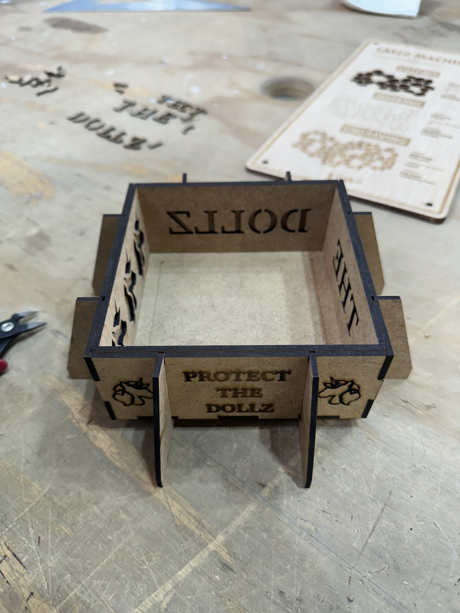
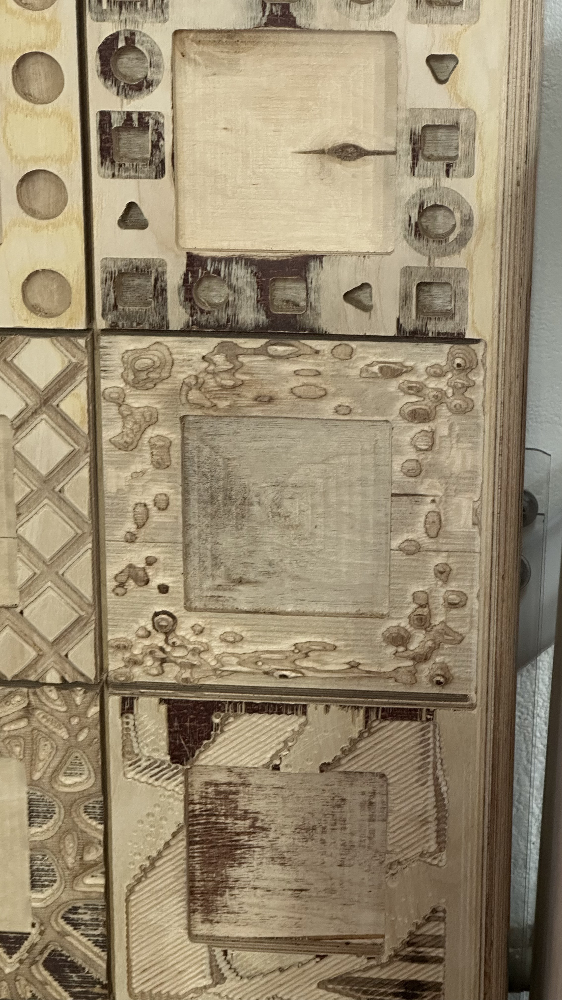
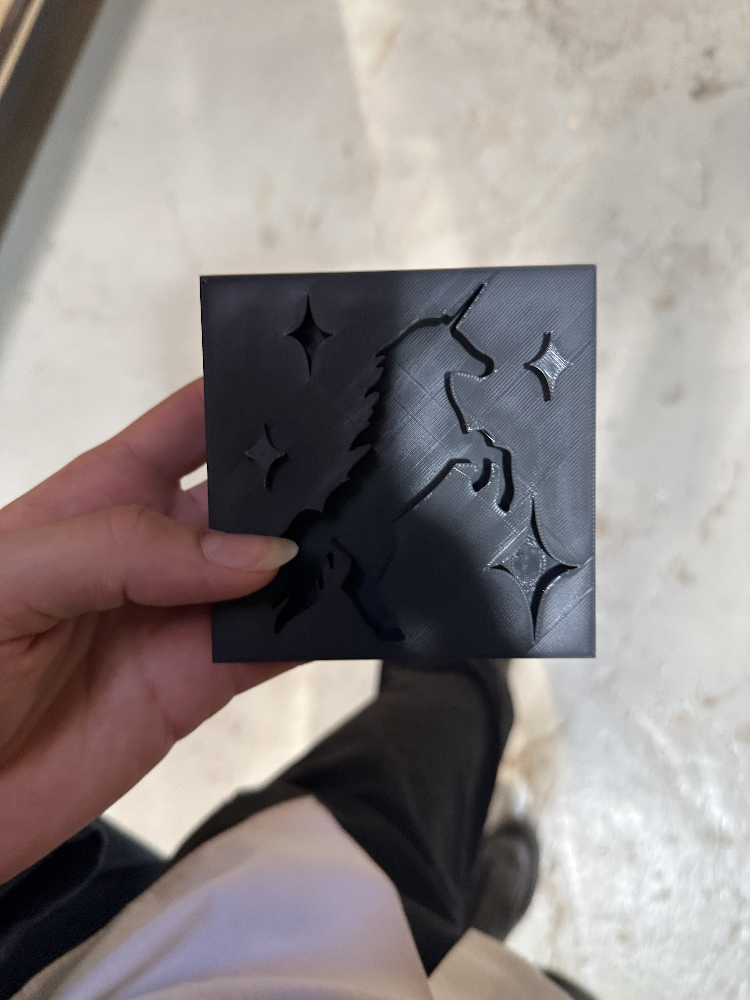
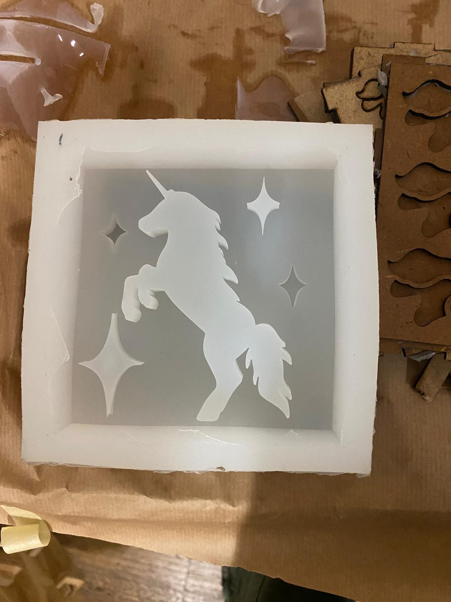
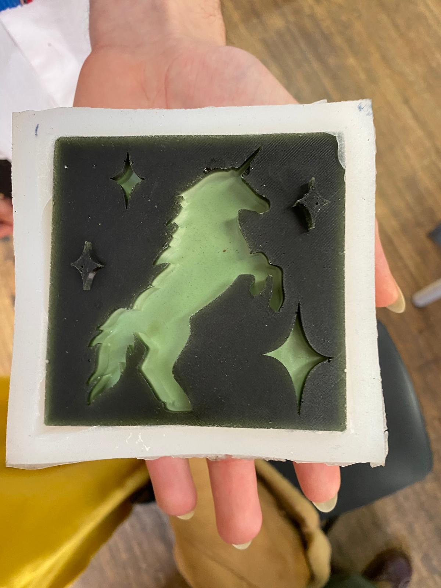

# Protect The Dolls

## Inputs and Outputs with Barduino

<iframe width="560" height="315" src="https://www.youtube.com/embed/3JFvwZGMPTI?si=KK453x5Xclqv3x6G" title="YouTube video player" frameborder="0" allow="accelerometer; autoplay; clipboard-write; encrypted-media; gyroscope; picture-in-picture; web-share" referrerpolicy="strict-origin-when-cross-origin" allowfullscreen></iframe>

Arduino IDE is a great tool to experiemnt with electronics and logic circuits. The barduino and learning how to use is was essencial for further project thinking regarding possibilities in upcycling electronic components.

## 2D Design and Fabrication

### Rhino

{ width="100%" }

I arrived to barcelona with an easy understanding and flow with Fusion 360 and CAD. Never interacted Rhino once. But when introduced to the software, the language felt familiar and easy to follow due to previous experience with 3d modeling and technical drawing.

The software and methods for laser cutting and CNC highlighted the significance of organizing layers of the files, so that the programing of the machines hold clear instructions for the path of the tools. 

### Laser Cutting

{ width="100%" }

Laser Cutting not only is satisfying as it is very useful for prototyping. In this class it was the starting process for the casting of the tile by designing the conteiner and external features of the artifact. Later was also very useful in exercises of Unpacking Tech Systems.

### CNC

{ width="100%" }

Programing for CNC machines is very similar to laser cutting. Layerwise. When in Laser cutting we mainly focus on power intensity between Cutting, Engraving and Marking. In a CNC we have a range of tools — Mills and Drills — that by doing the same path would reach very different effects.

The CNC was used to create a framing for the tiles, Alongside with Lo, our frame has cloudy movements and height contrasts that host the Unicorn Tile.

## 3d Fabrication

### 3d Printing

{ width="100%" }

When it comes to 3d printing, there might be a lot of factors to learn as I get familiar with the machines. But I can say that I am able to design and set to print an object confidently. The main points to take into consideration were: how would the silicone fill in the shapes when preparing the casting. 

### Casting and Molding

{ width="100%" }

Noting the PLA prototype was not the final artifact, the scale and angles of each shape were relevant factors for a smooth execution with the silicone and consequently any other composite like the gelatin foam.

### Composites with Biomaterials

<iframe width="560" height="315" src="https://www.youtube.com/embed/8zF1tUz8yhg?si=2AbRzc4l_ce2eEyA" title="YouTube video player" frameborder="0" allow="accelerometer; autoplay; clipboard-write; encrypted-media; gyroscope; picture-in-picture; web-share" referrerpolicy="strict-origin-when-cross-origin" allowfullscreen></iframe>

There is an infinite range and possibilities when it comes to biomaterial recipes. Each time, a composite holds an unique property due to the possible ranges within each recipe regarding color, flexibility and texture. In between testing with resin and woodstraw, we filled in the tile mold with a gelatin foam recipe, courtesy of Agnese. Which smoothness and bubbly texture fitted the universe of the "protect the dolls" univorn tile.

<iframe width="560" height="315" src="https://www.youtube.com/embed/qfH5q9SD5GQ?si=KeRylGalLuG16lNT" title="YouTube video player" frameborder="0" allow="accelerometer; autoplay; clipboard-write; encrypted-media; gyroscope; picture-in-picture; web-share" referrerpolicy="strict-origin-when-cross-origin" allowfullscreen></iframe>

{ width="100%" } 

## TouchDesigner

I'm very entusiastic about using Touch Designer in the future, after grouping all of these samples regarding electronics and structures. This software can boost any project into a more immersive experience.
