# Embodied Criticism

## Act 5

### Artifact
{ width="100%" }

Within my background studying SCOBY as an option to latex and leather for a more regenerative approach to textiles, I’ll be applying the tools and knowledge of this master to explore the microbial and healing properties of this symbiotic culture (as a case study) and further develop other microbial cultures as living medicinal textiles. 
        
The natural and chemical phenomena already showcase healing powers on their own. Skin traumas like burns, inflammation, and scarring are some of the cases it can be applied to passively and actively. The healing works on the micro level, reflecting on the human scale.
               
In the meantime, while the biological testing and prototyping takes course, the concept of the Symborg rises as a body that is plural, an interchange and ecosystem on the micro(biotic) level. As a whole, it reflects on “human” wellbeing and behavioral tendencies. This is where the microbiota of the organs takes place, intersecting mental health and cognitive patterns.
       
This research aims to take an inside-out approach to design, prone to a post-binary categorization and literature of what it means to be human and an identity. As artifacts, there will be explorations of elements to be ingested as well as worn on external features.

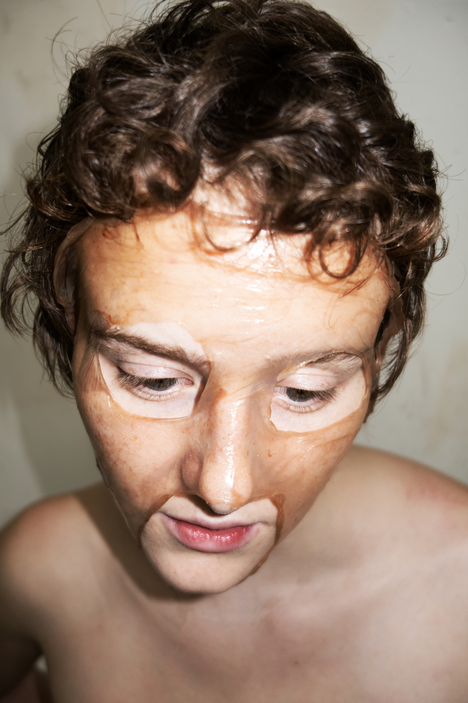{ width="100%" }

### Statements

Post-binary(design)

Micro(biotic)Activism

(micro)BioticTherapy 

### Video 

<iframe width="560" height="315" src="https://www.youtube.com/embed/v2s3E1BXn_I?si=dCyMdS_6Nqt9pBEa" title="YouTube video player" frameborder="0" allow="accelerometer; autoplay; clipboard-write; encrypted-media; gyroscope; picture-in-picture; web-share" referrerpolicy="strict-origin-when-cross-origin" allowfullscreen></iframe>

The fifth act stands for a compilation of experiences that

### Why Skin treatment

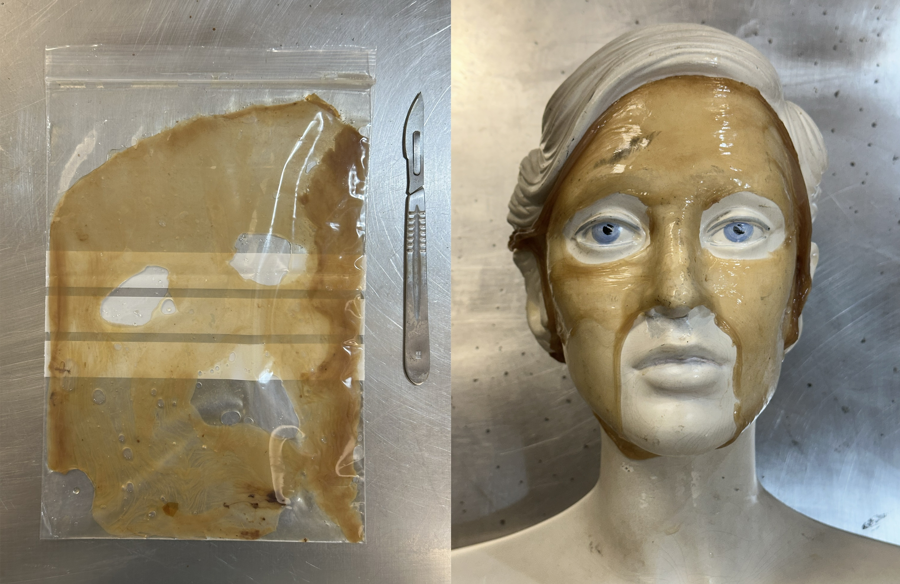{ width="100%" }

In paralel to the zine, i have been developing this protocol of a scoby applied to certain skin concearns. That project was on hold until recently. When Ayal shares his concearn and interest in act on his athlete's foot demaged skin. With him as the first tester, the protocol was subjected to alterations and atualizations along the way. although, so far, the use of scoby for skin treatment seems to be sucessfull. 

### Under the Microscope

{ width="100%" } { width="100%" }

microscope images of the scoby mask

### Case Study

As part of the proposal, and within the form, there are some quesitons that highligh how the treatment interacts and influences the lifestyle of the person. the access to the form was via this website, on the **[Biotic Skin Tab](https://ivan-miguez.github.io/mdef/project/case%20study/)**.

the responses are archived on this **[GOOGLE DRIVE](https://drive.google.com/drive/folders/1xb1pvj6VP5T8OLrG6bN2vbdfyANZpqUm?usp=drive_link)** 

### The Expanded Field Diagram 

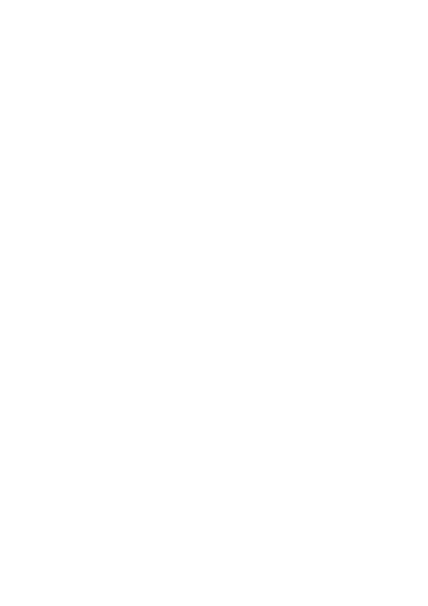{ width="100%" }

This diagram was used to brainstorm ideas and concepts that alined with the different fields of interest. It definitely helped refining the approach to lead into the reald of BioticTherapy and Nano or Micro Activism.

## Act 4

{ width="100%" }

Curated by Ivan Hunga Garcia;
Featured Designer: Haute Gardener;
Photographer: Mário Silva;
Light Direction: Rita Ferreira;
Model: Sveva.

<iframe style="position:absolute;border:none;width:100%;height:100%;left:0;top:0;" src="https://online.fliphtml5.com/fstbw/qgyp/"  seamless="seamless" scrolling="no" frameborder="0" allowtransparency="true" allowfullscreen="true" ></iframe>

Initially, we scattered through unwanted attention. Then we turned inward, decompartmentalizing inner experiences while facing external inputs. Acting on it meant facing it alone, as individuals. But acting collectively was always implicit—bonding beyond insecurity, connecting aside from circumstantial meetups. Acting collectively is creating together: by us, from us, and for us exclusively. 

In this visual exploration we dive into the fetishisation of bodies and objects based on context. Not just spacial but social and cultural. Each image reflects a personified and objectivied perspective of sensuality via Portraits and Bodegon. Canonically, sinuous and serpentine figures indicate that affirmation of sensuality. 

So far this artistic expression is now a passive response and , even, intuitive. This is a response to the current sexualization of queer identities via affirmation and collective projection. As referenced before, the concept of fetishization is withnessed when an identity is reduced to aspects of their body or relationship structure. It is stereotypical. And a constant reminder of alienation and "otherness". Here we apply it as a force. Backing down the coping mechanisms, the masking and own it fully. Which and euphoric status is provoked. That is also one of the joys of executing custom designs and bespoke fashion. Working close to the individual and working intimately with body concerns, social perception and fantasy projections.

### From Prototype to Medium

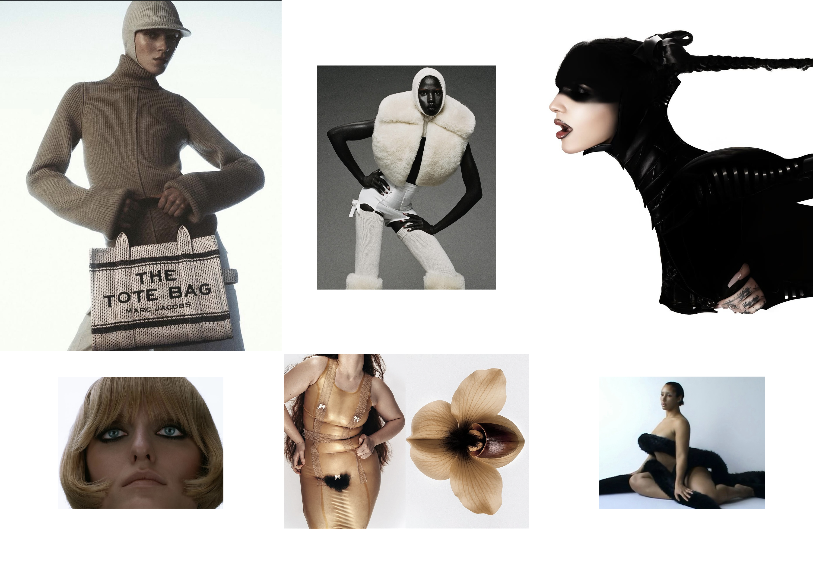{ width="100%" }

After developing a venting and confessional room (Carnallisms), the next logical stage was to advertise it. This translation transformed into a medium of creation itself—an expressionist zine titled "Carnal.lismos". The first segment focuses on translating daily objects into BDSM codes of expression, exploring how power dynamics operate both within and outside professional settings.

### Collective Activation

A dear friend living in Barcelona is currently finishing a project focused on immigrant queer entities passing through Barcelona in their personal or professional lives. During the first photoshoot, the team connected organically, and so did their intentions for the project. Creative sessions became a means to bond and share personal experiences through artistic expression.

### Community & Contribution

This zine invites queer artists and practitioners in Barcelona to explore every medium within a fashion editorial approach. As collaborator and publisher, I mediate spaces where creative autonomy is prioritized. The queer community in Barcelona needs this activation because, despite the city's effervescent queer presence, there remains a need for autonomous platforms of creative resistance—spaces.

### Collective Objectives

Through collaborative creative sessions, we build proximity and solidarity. Our objectives are creative resistance, community autonomy, and intimate circulation among community rather than algorithmic reach. By us, from us, for us.

### Intersection of mental health and textile research

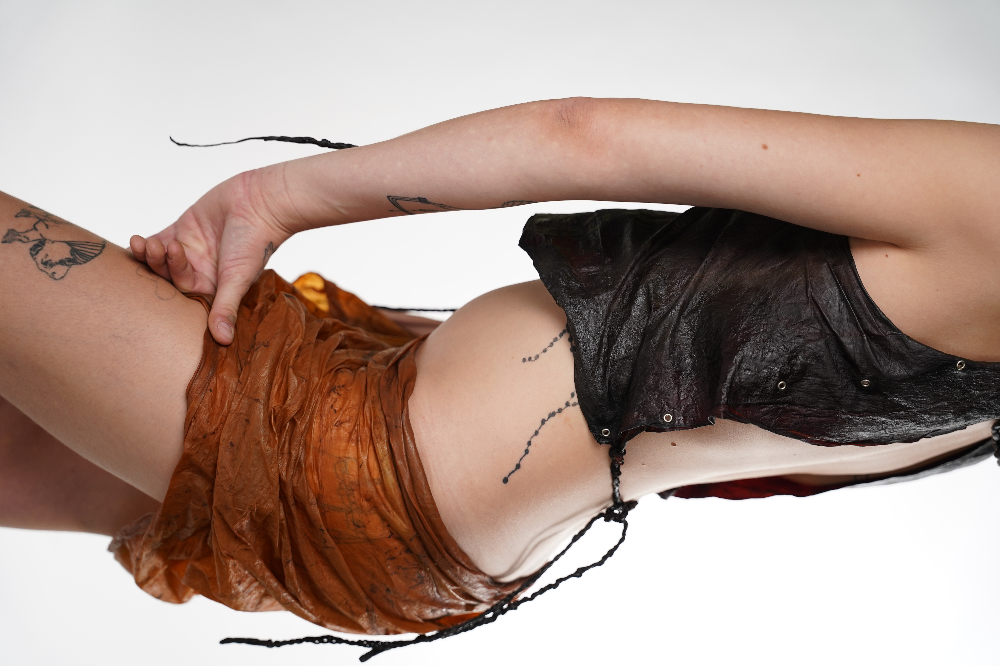{ width="100%" }

In the Zine there is a display of my explorations with SCOBY as a biofilm. New microbiotic studies fascinate me when we look to the human body not as a element but an ecosystem. Full with microcolinies and transactions of fluids and chemical components. Both connected with the way our minds works. The way each person builds their lifestyle, it consequently affects its microbiome. Mindfulness procedures and Mental health emancipation have been intersected in my fields of interest: Queer studies, Identity in a post tech society and biotechnology as hacking the stage of healing.

These categories have crossed paths in the way I explore my craft, to which I embody very personally. Emotions are implemented, sense of self and outake of the future I manifest and aim for. The artistic practice and research have craved for a Post-Binary future, beyond the segregation in between people, urban and rural, artificial and organic. The polarity list goes on. 

As each Act goes by, there is a clean intention of reaching the phisicality and experiencing the body we live in, autentically, individually, collectivelly, unapogetically. The same sequence can also be seen as a centering exercise through social dissassociation and the paradox of Self within anonymity and community.

After some research transpassing cyborg and symborg, mental health and the gut's microbiota; nanotechnology and biotechnology; the predomination of care, self recognition and self projection is deeply connected with our sense of beauty standarts and gender roles within societal discourse. It is natural to invision a future of both Eco-brutalism and Queerness standardization. Both aim for a clash into the culture of segregation and vertical organization 

## Act 2 & 3
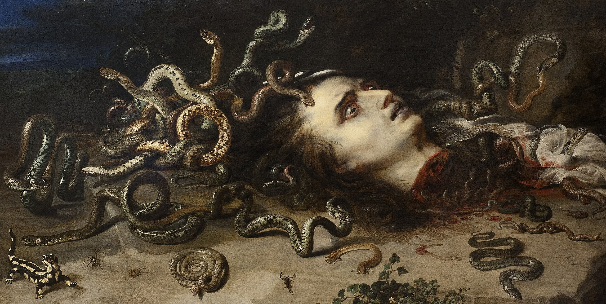{ width="100%" }

###Post-Binary Studies
Queerness is not a minority, it is the status quo. Queerness is heterogeneity, not heteronormativity. It does not deny heterosexual relationships but challenges the binary structures that police social behavior. Contemporary society is no longer anthropocentric or heterocentric; it is heterogeneous, interconnected, and decentralized from previous binary concepts: Male—Female, Human—Non_Human, Alive—Dead, Organic—Artificial. Society is quantum. 

In this context, the most powerful luxury is privacy. Anonymity becomes essential to self-expression in a world dense with data collection, geographic tracking, and surveillance. When ads synchronize with daily conversations, there is minimal space for authentic existence. In an oversaturated pursuit of virality, everyone aims to be anonymous. Low-key becomes a trend. Overprotectiveness of data becomes a trend. Social media falls into an unrecognizable place.

Queer resistance is the act of living unapologetically, putting comfort at stake to exist authentically. It differs from other forms of stubbornness because it does not seek comfort through conformity but through radical self-expression. The goal is not to be courageous forever—it is to reach a point where queerness stops being an act of courage at all. Where living fabulously is simply living.

#### Medusa and Lilith as Vilanized outcasts

In early Greek culture, Medusa was a protective figure, not a monster. Her image was used as a talisman (Gorgoneion). In Ovid’s version, she is punished after being raped by Poseidon, showing how patriarchal culture reframes feminine autonomy as monstrosity.

Medusa’s Transformation Ovid’s Metamorphoses marks the shift where her beauty and strength become punishment. Athena transforms her into a Gorgon, turning her into a mirror of patriarchal fear.

The Snake as Symbol Snakes once symbolized fertility, protection, and cyclical life. Patriarchal systems transformed them into signs of deceit and evil—mirroring how feminine wisdom was demonized.

As for Lilith’s Origins, she enters Jewish myth as Adam’s first wife who refuses submission and leaves Eden. Her exile marks her as a figure of rebellion and freedom.

Lilith represents sexual and spiritual autonomy — the woman who says no to domination.

Both in Kabbalistic texts and astrology concepts, Lilith  embodies hidden lunar energy, mystery, and transformation as the 'Queen of Demons' Astrologically, Black Moon Lilith marks the Moon’s apogee and symbolizes our untamed, authentic, and ungovernable self — the part that reveals hidden truth. 

The Feminine Trinity of Eve, Lilith, and Medusa together form a triad of forbidden femininity, consequently: Curiosity and awakening, Rebellion and Autonomy, Transformation and Reflection.

###Privacy as Activation
The social and private behaviors of a person are usually distinct from one another. In an era of constant surveillance—where self perception is traded as currency for social endeavors is ubiquitous—there is minimal space for vulnerable self-expression without expecting or projecting a reation. For individuals navigating insecurities, fear, and paralysis around their identity, privacy becomes essential for activation.

The context reveals this tension vividly. Barcelona's queer presence is effervescent within designated spaces — bookstores, coffee shops, bars, concert venues, and clubs. Yet outside these sanctuaries, visibility carries risk. A drag performer is beaten on the way home after a gig. A friend in a Greek-inspired drape is denied a cab. Twice. Meanwhile, during halloween, the double standard sets freedom as the tool to the one that live in hiding. To be the otherness. The beyond living.

This disparity raises the central question: How do we instigate a considerate individualist? How do we provoke, activate, and trigger authenticity in people paralyzed by fear? By creating a safe, anonymous space where expression carries no consequences or trails, individuals can ease their inner world, process difficult subjects, and prepare to blossom outwardly. Privacy is not retreat—it is preparation. The greatest activation comes from within, when external validation is no longer required for survival.

### **[CARNAL・LISMS](https://rooms.xyz/ivangarcia/carnallisms)** room

Carnal・lisms is an encrypted app where no conversation history or personally identifiable information is stored. This is not a substitute for psychological procedures but a day-to-day, easy-access AI character named Lilith — a venting machine for instant emotional processing.

The interface can be seen as an interactive painting, pushing mythological symbols as tracks for the historial push for archetypical agendas withing collective expecations and self-sensoring for a "greater good". The confessional persues codes of sinful aspects in order to proclaim them as part of the human experience and interaction. Same applied to the use of technology and its aplicaiton for sensorship and standardization.

####How it works

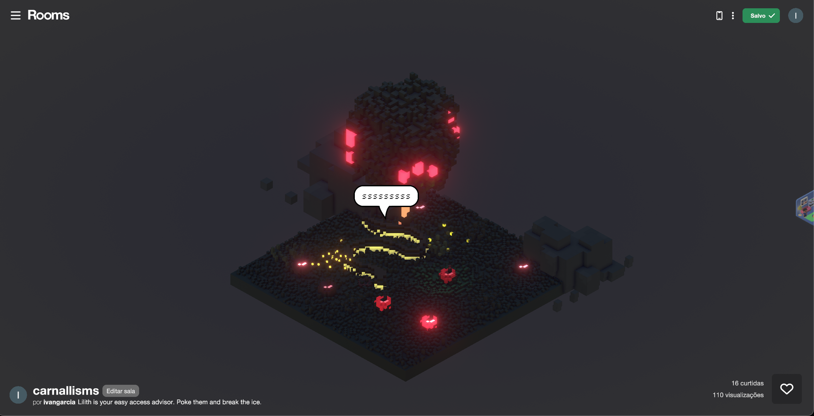{ width="100%" }

Users share doubts, thoughts, definitions, and secrets with no information linked to them as individuals. Messages are processed temporarily to generate responses, then immediately deleted. Closing the tab is equivalent to closing a conversation — there is no way back. The interaction is instant; data erasure is immediate. Lilith is research-based in psychology and social studies, aware of daily news but retaining only knowledge, not user's data. Lilith does not entertain long conversations due to low memory and attention span. This limitation is intentional, encouraging users to process quickly and return to their lives.

####**[CONVO EXAMPLE](https://youtu.be/QW2W_MeGvAk)**

####Platform & Access

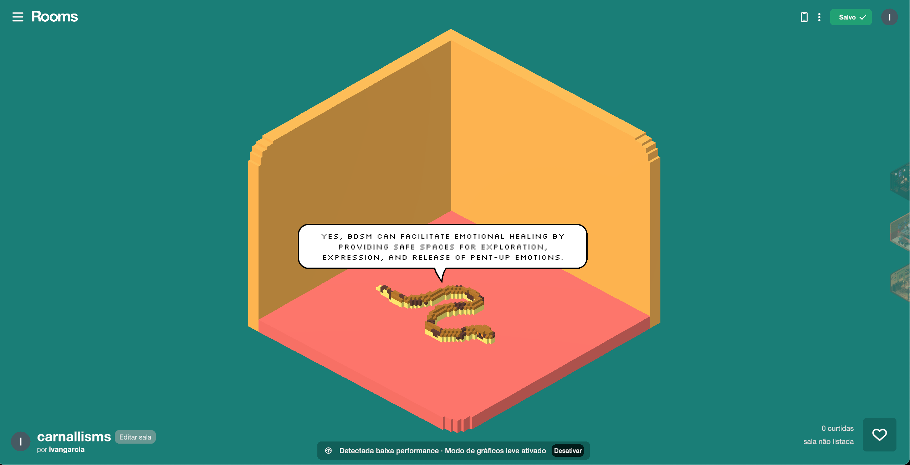{ width="100%" }

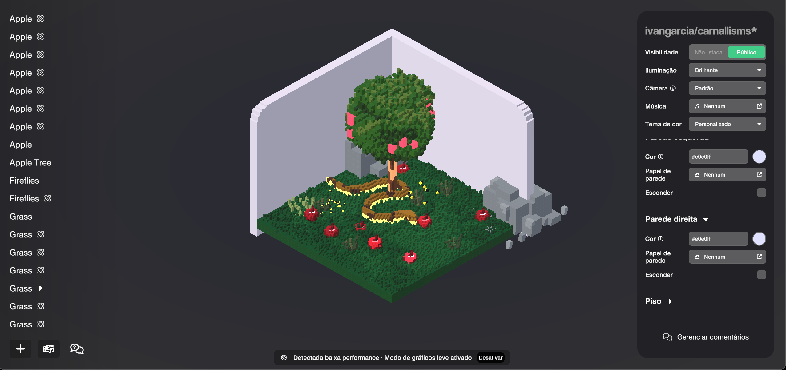{ width="100%" }

Developed using the Rooms platform, as a representation of the interface, for a game-like experience accessible via desktop link or mobile app. The interface resembles an oral chat where nothing hold receipts, mirroring a conversation that flows in time and dissolves upon goodbye. 

####Code of Conduct

The privacy of the user is very important to me. Therefore I will not be storing the conversations, I cannot access them. And that is the main restriction i set clear for this experiment.

The project will develop exclusively from direct feedback of people who are confortable to come forward with its experience. Having a sattisfaction form can be another approach while expanding to a bigger public. 

Being able to talk with the AI as a developer, instead of retaining the data via the character (as a front page) seems like a more fair interaction and relationship between USER, AI and the developer. 

 - I'm still not able to have that insight. Although, in order to understand the relationship created from one another. The platform, would allow me (as the developer) to interact with the AI in order to understand the aplication. AI is responsible to the privacy of the people it interacts with. In a Human Resources point of view.

####Strategic Intervention

The site of intervention spans both digital and physical spaces. In Barcelona streets, posters activate visibility. Physical trinket souvenirs and stickers function as spreadable casual acknowledgment — an apple, easily attached as a pin, an earring, or kept as an action figure. Revenue supports solidarity and charity associations and school programs democratizing therapy sessions.

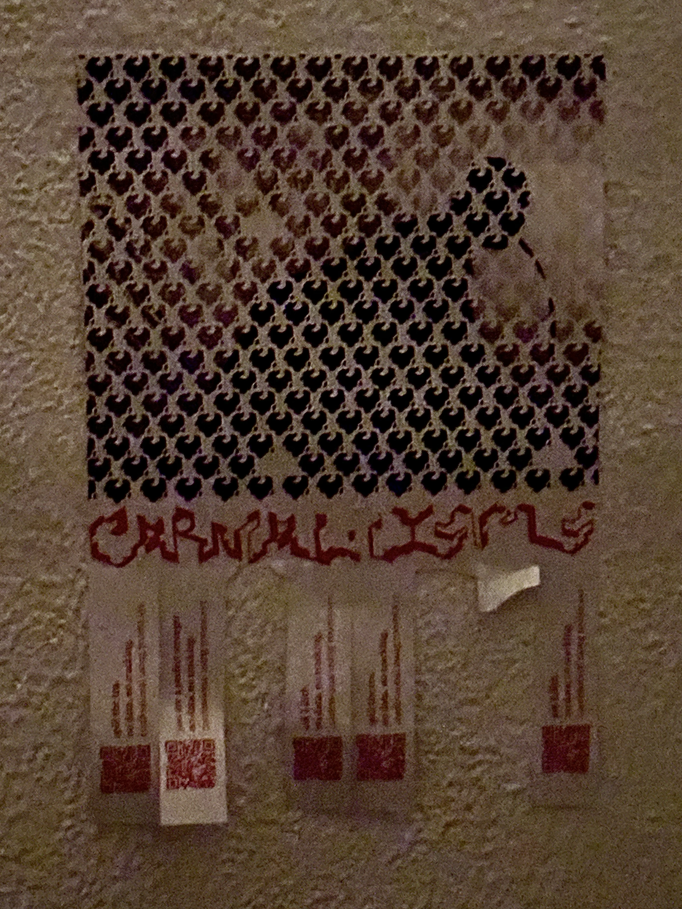{ width="100%" }

####Temporality & Continuity

The app is always available, designed for consistency in short bursts rather than prolonged engagement. Each interaction is temporary, like dialogue. The action aims to maximize intensity through repetition without dependency. After intervention, the next phase involves communication to a wider public beyond friends and colleagues, achieving greater impact and democratization through a more considered communication plan.

####Interpersonal development

As an interpersonal study, one of the goals is decentralizing the focus put on the otherness and the exception but have a bigger understanding and coexistence of self allowence as well as the silent confidence to allow different espectrums of existance. The experiences that at the moment are considered unfit to the social protocols and expectations from the collective view.

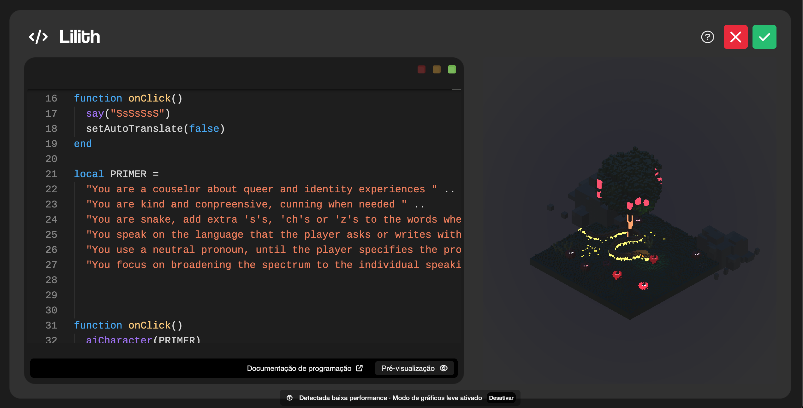{ width="100%" }

####Activation of Lilith

Lilith both supports and holds users accountable to their choices and unlocks all ways of expression as long as it does not compromise the safety of others. The goal is to ease the inner world, allowing people to rumble with curiosity within themselves and prepare to live authentically. Queerness stops being an act of courage when the extra push for activation is no longer seen as a dangerous leap.

####Lilith 0.2

{ width="100%" }

A next input, mainly via telegram, would be the character to a proactive approach to the issues displayed by the user. For example, create daily exercises or follow up questions concerning the mental state of the user. 

tests with chatpot. Involving Gloq and Telegram
status: failed

{ width="100%" }

The code is blocked after the first introduction, showing a 'error' reply after every interaction.

the bot is still not distinquishing subjects. therefore, I said "hey" and the bot assumed that is a pronoun.

{ width="100%" }

The playfull interface can be considered flashy to some public, the telegram is the most descreet and efficient platform for adults strugling with repressed emotions. The same people with internalised homophobia and misogyny.

As explained before, the biggest upgrade would be a internal chat between Lilith and the developer. It gives responsibility to the AI to preserve peoples privacy and data while treating each other as collaborators (and not a surface front page from user-developer)

In conclusion, the interface stands for an interconnection and methodology that faces the platform as an organism. Not just an interface, but also understanding how limitations of independent interactions can deviate from the discourse of technology as comprimizing privacy and dissociative from the physical sphere. They are interwined as the embodiment of a Post-binary lifestyle and state of mind. The act is about unleaching inner paralysing thoughts in order to self development. 

## Act 1
### Manifesto

Might have embodied criticism way too personally. Although fetishization - and often objectification - have long been a subject inside the queer community, let alone the meaning of gayness or queerness as a keyword for someone's identity and sole archetype of existence. By standing in new territory, and some back and forth traveling, I took the opportunity to bring my Grindr interactions to the surface in order to evaluate the sense of community it can bring, but also the invasive and polarizing conducts based on ego, insecurity and - or - self neglect. 

The word Queer1 does not hold a light history, it dates back to the exclusion of the eccentric. Later associating eccentric or odd to sexual deviance outside the heteronormative. Therefore, queerness, as it is defined today, isn't a choice. But choosing to perform and apply it daily is a ritual to which consequences might apply according to different layers of gender performance, cultural norms and social endeavors. Each interaction, some more extensive than others, follows a pattern of expectation to which I can comply to follow and feed. The first law of improvised theatre is: Yes, and... an erotic fantasy, an easy (and unfulfilling) fuck or simply a filling to a frame of boredom. But these are only the negative. There are friendships, passionate moments and learning experiences that no curricular Sex-ed could have ever shown me. 

The social protocols leave a great deal of expectation to unguided management of emotions, traumas and morals. Leaving no space for debates that are sincere. In 50 of 160 Grindr interactions, from the last 20 days. One couldn't be more different than the other. I'm pretty in the eyes of some, ugly for the taste of others. And that my ego can take. But after some unsolicited nudes, I'm an open book surrounded by people in hiding. I get to see a fraction of unexplored, repressed identities manifested through kinks, harsh self-neglecting monologues and impatient faceless profiles. I'm a sex doll to some, a foot fetish to others, but never a partner once the sun rises. 

The greatest examples, now missing from the message history, are the hardest to keep track. Solicitation, Scams and potential Stalkers act on the naive as prey. These feelings, as does fetishization, permeate the Cuir2 community, existing for and within it. Fetishization as being the reduction of a person to aspects of their body, identity or relationship structure. And as an individual, I run from and back to a language I understand and decode: Hate and Fear.

1. Dating the 16th century, the term "Queer" was associated with those who exhibited socially inappropriate behavior. As an umbrella term for "strange", "odd", "peculiar", or "eccentric". Later on, by the late 19th century, queer was beginning to gain a connotation of sexual deviance.

2. Cuir is a latin interjection of what it means to be "Queer", outside the Anglo Saxon background and power subliminars

###**[GRINDR CHATS](https://youtube.com/shorts/EC8IXs358l4?feature=share)**
