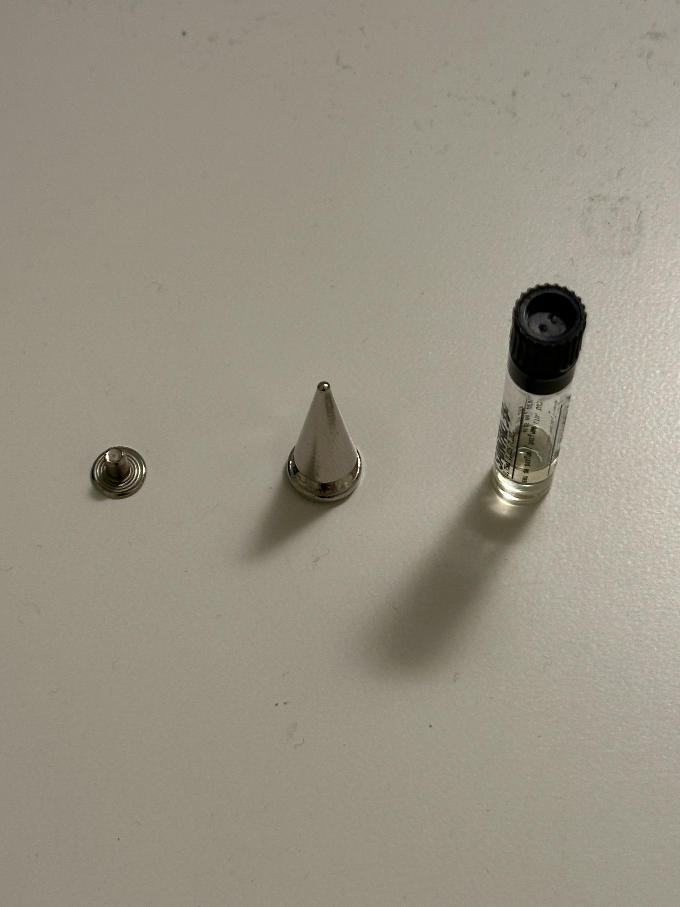
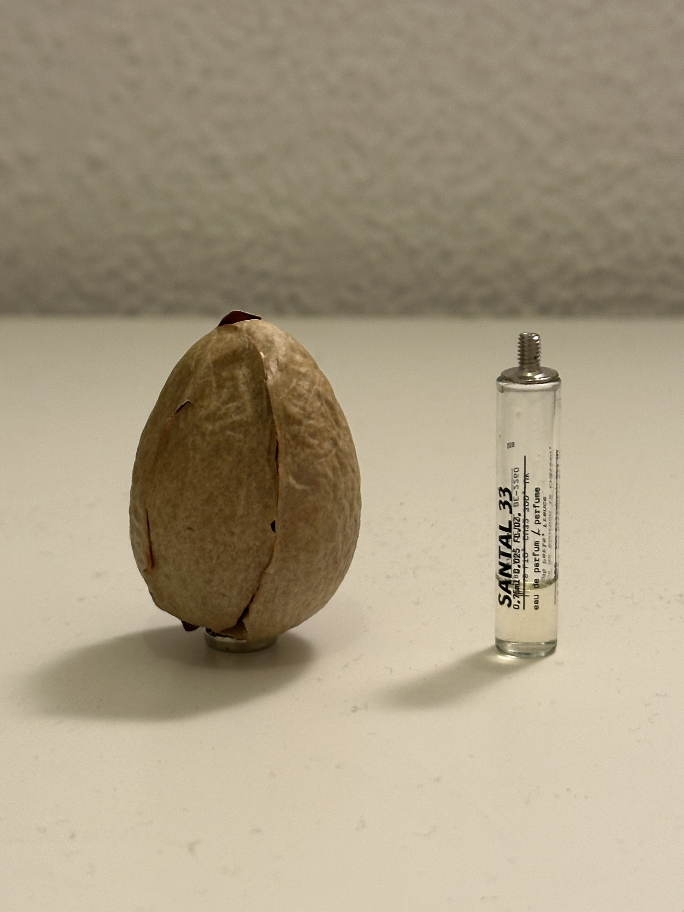
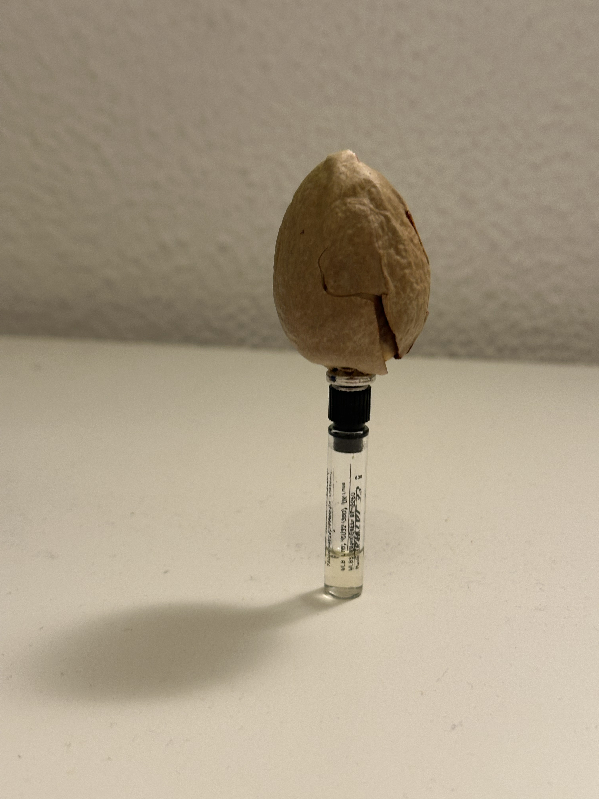
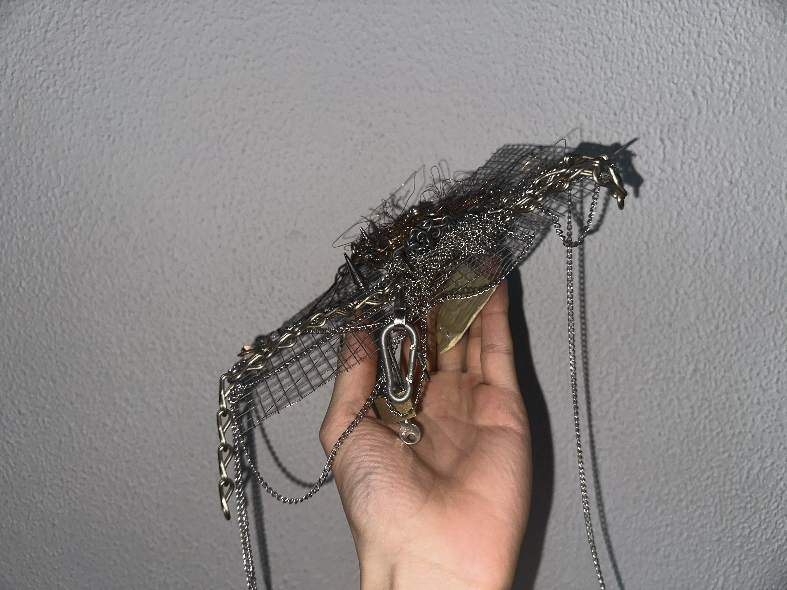
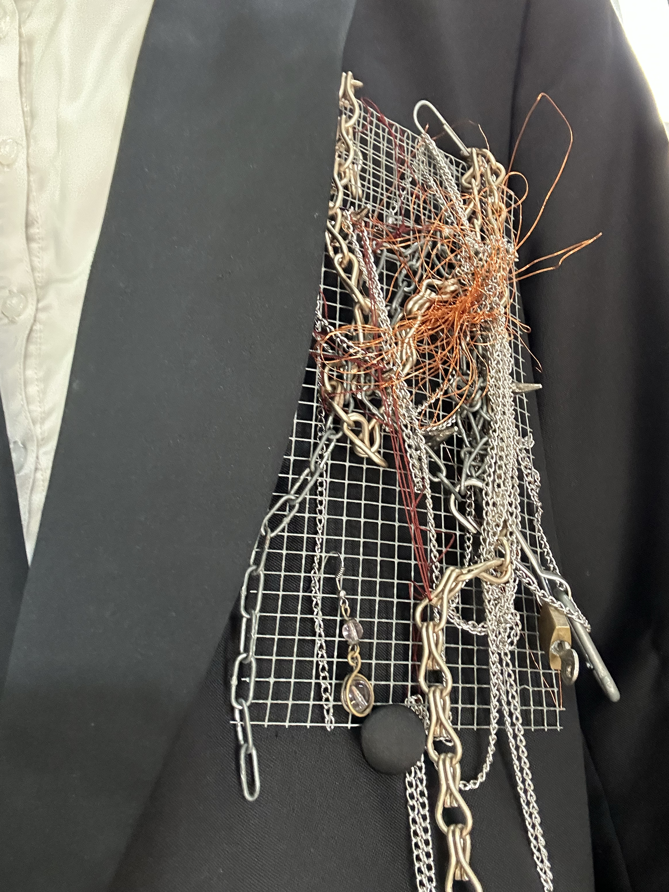
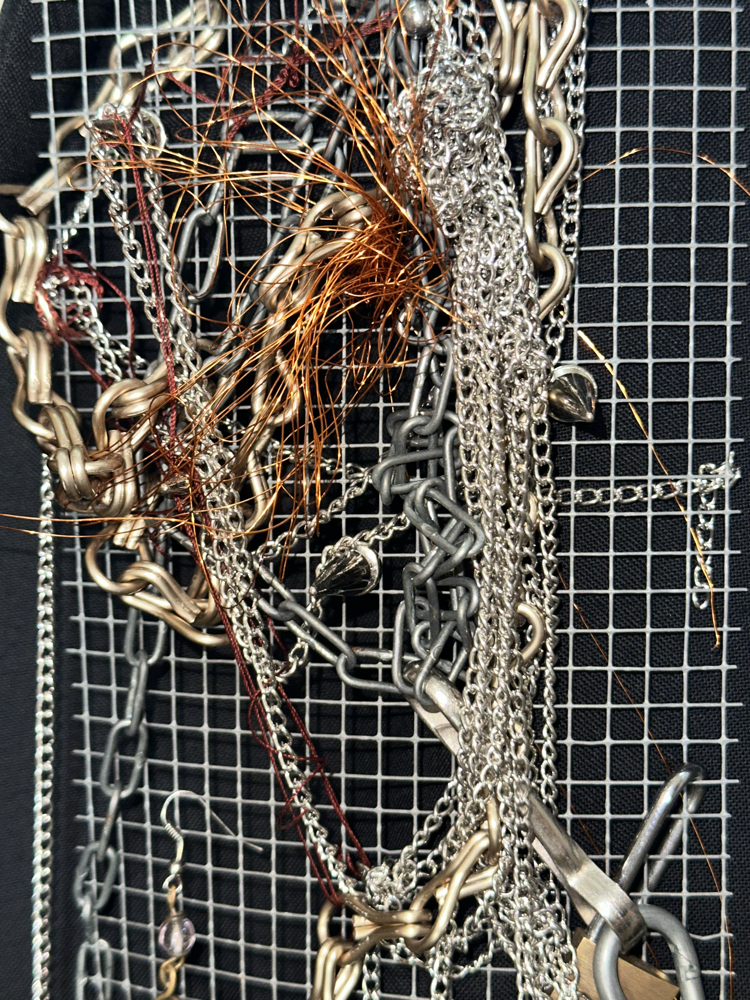
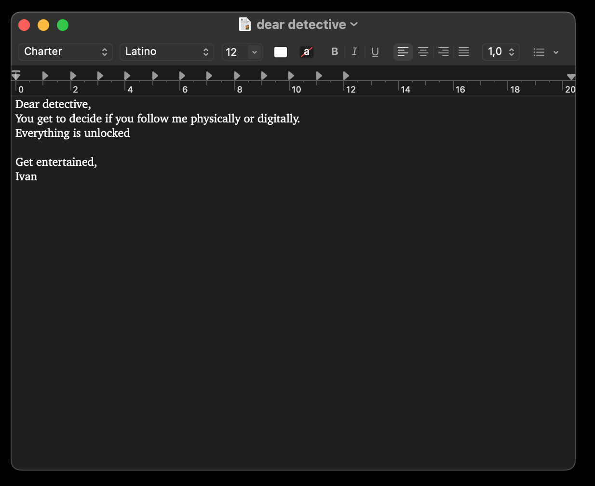

# Living With Your Own Ideas

## Post-prostheses Essay

The concept of prostheses is not so far-fetched than what we make it to be. The optimization of the human body is an omnipresent pressure and subconscious craving. It also dates back to ancient Egypt and Iran, from myths, traditions and superstitions. Prostheses can either be practical, symbolic or both. They hold personal meaning on what we aim or bodies to be and achieve in a lifetime that expands day by day.

In Ancient — and mythological — Greece we see Gods with prostheses that are metaphors to their beyond-human capabilities. They hold the meaning of how we see human nature outside human physical limits and expectations. They are aspirational. And so are prostheses.

Within 3 rhythmic briefings: “To be the best version of yourself”, “To become something else” and “Judge / To be judged” it was clear to me the approach of self applied prosthesis to be immaterial, invisible, untouchable even. My physical condition is my least concern in regards to my imaginary reach. Unsettling and insatiable by default. 

Those two words define the status-quo of the occidental lifestyle, optimization within the eyes of productivity and efficiency. But efficient to what and to whom? To defend or reach an endless loop. We reach a stage where it is important to strip away excess. Strip away from unanimous expectations, yet involuntarily proclaimed as a coping mechanism.

My phostheses were not about adding up features, but to take away. Decompartmentalize the mental blocks and clouded instincts. When using perfume, deviating metals or unlocking passwords and timeframes, it is also an aim to unlock anxiety and welcome the uncontrolled profile of the outsider, starting from the inside. Also to understand the power of being naive and still expect the best from an unrecognized hand. The art of give and take. Reciprocity.

Human extensions, mental and physical, usually are a reaction to the craving for belonging. Adding personality traits, adding boundaries, adding beauty stereotypes. When the most intriguing quality in a dialogue is the benefit of the dough, letting the unknown unravel a new sense of purpose within the sense of self and interpersonal interactions.

## Prosthesis no.1

{ width="100%" }

{ width="100%" }

{ width="100%" }

I find it unfair, everyone has the benefit of feeling my perfume collection except myself. Everytime i try a new fragrance there is an awareness and mindfulness, stimulated by a new scent according to the same surroundings. A fragrance implant, implies an extra accessory as an extension of the human presence. 

That being said, a microdermal closed with a ceramic female piece allows a stock of perfume to be diffused with a long lasting effect. In critical moments, scratching the surface with the fingers will boost its diffusal. 

 In moments of overstimulation, unsettling or just unease with the external world, this fragrance implant has focused on the principles of aromatherapy. 

---
See video of the **[SIMULATION](https://youtube.com/shorts/k5SWnX4CmLc)** and other **[ TEST](https://youtube.com/shorts/-pNpR-Y9ZpE)**

## Prosthesis no.2

{ width="100%" }

{ width="100%" }

{ width="100%" }

A great amount of sparkly things came across my way as I was heading home. From copper thread, to chains, or earrings. I assembled my “Diary of a Crow” with unreclaimed objects, due to the fact that I saw potential in them. 

Yes, I am a Crow and I have the need to display my latest treasures. This diary is a magnetic pendent, completed by my daily findings of discarded or abandoned items from the human sphere. 

I would never know what an earring is for, since I lack the volume of the ears. But it is my naivety that brings the joy in something “new”. As a Crow I get to decide, detached from the anthropomorphic social protocol. 

---

See video of the **[SIMULATION](https://youtube.com/shorts/QqqafylpkTs)**

## Prosthesis no.3

### Subject

{ width="100%" }

I took the chance of being a subject of an investigation to strip away my prosthesis of convenience and privacy. As the hour passed, my physical presence was a decoy to the presence carried online. 

My digital being, for a whole hour, was at the disposal of who dared to get closer to my devices. Close enough you could read: “Dear detective, you can choose between my physical and digital self to follow. Everything is unlocked. Have fun, Ivan”. And by this I mean my pc, my ipad and my mobile phone. 

As the micromanager that I am, I had no hesitation in confronting my detective and their narrative by adding intentional acts, casual conversation, and moments of absence. The detective was engaged, nevertheless compromised by clouding their judgement. Because if in the classroom my devices were passively open, as a person I was actively hosting the observer into my perimeter of vision.

### Detective

As a detective all of the notes were recorded via earplugs, to low suspission, the notes were externalized in portuguese as if I was making a phone call, this selection is named **[Spying monologues](https://drive.google.com/drive/folders/10zcvNTf2nFyA6-qQSK68tMcxr4KDavle?usp=drive_link)**

13:13; ##### leaves the 301 room

13:14; I went to the balcony to have an aerial view of the street

13:14, also inserting my headphones: Spying monologues begin

13:15; SPOTTED: ##### is heading right side the pujades street.

13:16; I'm out the IAAC building, turned right

13:18; SPOTTED: ##### is at the graffiti corner smoking and listening to headphones

// I panicked… ignored them completely… turned right and stayed in a garage.

13:20; Ale and Francisco showed up. A good excuse to pass by again.

13:20; LOST THE SUBJECT.

13:21; We went up the 'Cap problema' street.

13:21; Starting sharing data with other detectives.

13:22; SPOTTED, ##### is ordering food

// Stayed a tiny bit at the front door, Speaking to myself in portuguese

13:23; Found this park little complex. Thank you #####, for making me wait here talking alone.

13:26; ##### texted on the MDEF group chat: "Pretty sure my detective lost me"

13:27 ##### shares a pin location 'Casa Tao'

// Little do they know I witnessed her asking for a 7 euro quiche; Ingredients Unrecognized

13:29 I took a break; walked around; Feels weird watching people eat…

13:40; Reached IAAC, passively looking on the roof.

13:45; I arrived at room 301… Waiting for ##### to arrive the 301 again

13:48; ##### arrives in room 301 with a take away box.

The conclusion is: I'm not a very good stalker.

I value privacy way too much

---

¹ message to the detective