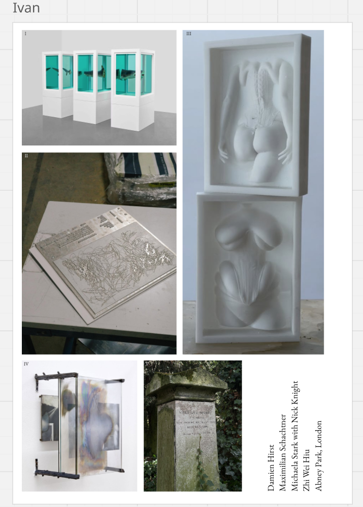

---
hide:
    - toc
---

# Pictorial Draft

{ width="100%" }

My research is focused on the medicinal symbiotic relationship between textiles and the human body and skin. Incorporating surfaces as living collaborative beings in the age of post-cyborg contexts. Therefore, exploring what it means to be a symborg, the publication will be a compilation of solid capsules through 3dprinting, embossing and engraving allowing the Microcultures to develop and exist in the inside of such hard pages. 

The incubation and applications comes from a place and consciousness of care both in a multispecies perspective but also interpreting the human body as an ecosystem to be valued in subjects like mental health by acknowledging the collective actions as one. 
	
Physically, the publication will consist of vacuum slides of demonstrative phenomenons applied to the artefacts created, as well as its textures, color tests and different stages of the developing process. Transparency and layering will be essential for the final form of the catalog. Acrylic, bioplastics and resins, both injected and 3dprinted will be primal in the making of the catalog as an artifact for consultation.

