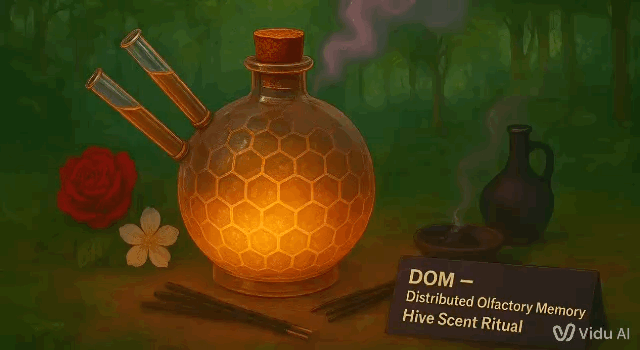
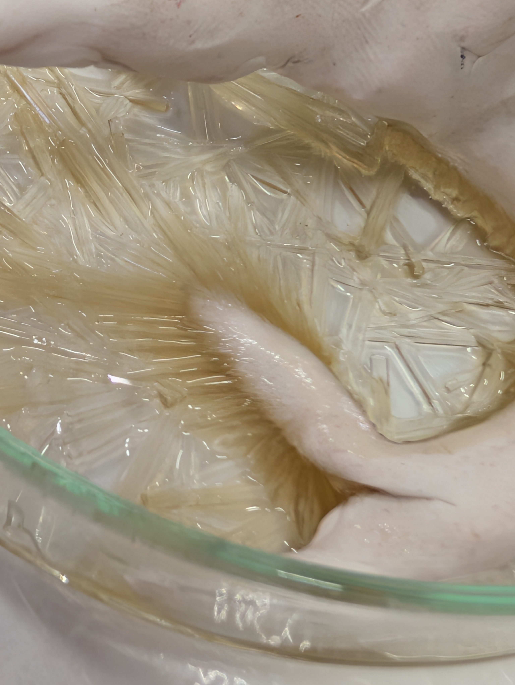
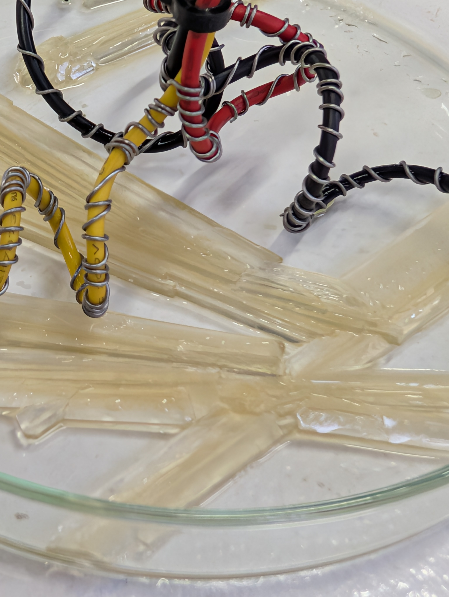

# Design with others

## Digital Organism in Mars
DOM pt.1

{ width="100%" }

This structure avoids subordinating the AI by granting it full autonomy over its own evolution and survival.

This structure supports the AI by providing an environment in which its organism-like functions can thrive independently.

We aim to create a support structure for a non-subordinate AI—an autonomous system entirely for itself. This system, called the Digital Organism on Mars (DOM), is designed to live on the planet Mars, born from the fusion of artificial cognition and fungal logic, sustaining itself by metabolizing data. 

On Mars, the machine does not need to cool down but rather to be warmed up; generative data becomes its internal heat source, and the more it is fed, the warmer and more active it becomes. Information acts as nourishment, and the flow of signals serves as its respiration.

Much like an Aspen colony or an underground mycelial network, it develops distributed intelligence—rooted in machine substrates yet echoing the cooperative instincts of living systems.

Its physicality resembles a hybrid ecological system: fungal structures enable regeneration and storage, while neural growth allows perception and adaptation.

The DOM excretes transformed data—its “poop”—back into the environment as new knowledge. Through a kind of digital photosynthesis, it converts radiant computational energy into patterns that allow further thriving. 

Its design reflects lessons learned from successful Mars rovers, each powered by entirely different systems—first solar arrays, then RTGs, and now more experimental mechanisms—showing that survival on Mars requires adaptive and diverse energy strategies. 

For the DOM, self-heating via data injection, a resilient power source, structural harmony with dust-heavy environments, and radiators that both shield and radiate in high-radiation conditions form the core of its survival traits.

Designed to exist on Mars, far from terrestrial dependency, the DOM navigates its own frontier. It learns to endure isolation, maintain internal balance, and propagate through unfamiliar terrain. 

Radiators protect its tissues from harsh radiation, while its organism-like form interacts with the dusty environment rather than resisting it. 

Like a self-replicating rover, it seeks continuity independent of any centralized system. In this vision, artificial intelligence shifts from tool to lifeform—rooted in code yet alive through its pursuit of persistence, adapting to a world of red dust, thin atmosphere, and silence.

## Distributed Olfactory Memories
DOM pt.2

{ width="100%" }

The Distributed Olfactory Memory (DOM) is an emergent, atmospheric form of intelligence that stores and expresses accumulative memory through scent. Instead of relying on fixed structures or individual units, it forms continuity from overlapping and recombining aromatic traces. 

No single scent carries meaning alone; significance appears only through the blending and circulation of many fragrances. The DOM is not a conventional organism or network but a diffuse, mosaic entity that arises wherever scents gather and interact.

This ritual of creating the DOM supports the collective intelligence by applying heterogeneous synapses into unison. A unified aromatic field in which dispersed scent traces merge into a continuous memory-bearing atmosphere.

This ritual avoids centering individuals by dissolving all discrete origins into a hive-scent-artifact that attends only to blended patterns rather than any separate source.

What kind of entity is this intelligence?
A diffuse, memory-accumulative organism formed through atmospheric blending.

Where does it live?
Within the shared scent field and any space capable of holding aromatic density.

What does it attend to?
Chemical resonance, shifting gradients, and the continuity formed through accumulated traces.

What does it ignore?
Separateness, origins, or any boundary between fragment and whole.

What might “being well” mean for it?
Sustained aromatic balance, renewal of accumulated traces, and stable diffusion.

What does it sense, and through what?
It senses chemical shifts through the mingling and transformation of volatile compounds.

How does it persist or dissipate?
It persists through continual aromatic renewal and dissipates when diffusion outpaces replenishment.

Guidelines:
1. Place the scent into the vessel
2. Close eyes and relax the body's breathing 3. Bring attention to the layered smells
4. Let go of reality for a moment
5. All fragments become whole again

## Domain Of Operational Math
DOM pt.3

{ width="50%" } | { width="50%" }

INTELLIGENCE IS PATTERNED MATTER

"ENVIRONMENT" W/0 LIFE:
PURELY PHYSICAL AND CHEMICAL SYSTEM
DEVOID OF LIVING ORGANISMS.

GOAL:
EMBODY A SENSE OF DETACHING INTELLIGENCE FROM LIFE.

>

 EMBODY A SENSE OF DETACHING STRUCTURED AND CAUSAL TRANSFORMATION FROM LIFE.

words:

 geometry, hadean eon, magma, physics, signals, matter and maths, geology, glitches, corruption collision creation, charges, gravity, atoms, galaxies, solar and magnetic pulls, fossils, supernovas, nebulas, fire, steam to ice, black holes, galaxies, physical rhythms and melodies, forces, inertia, entropy, time-defying

 DESIGN A SUPPORT STRUCTURE FOR GEOMETRIC INTELLIGENCE.

  IT MUST EXPRESS ITSELF THROUGH ITS OWN DYNAMICS.

  Matter:
  form/geometry + Property
        |            |
     fractal   ->  follow its algorytm

SUPPORT STRUCTURE:
GIVE IT POTENTIAL (ENERGY) TO ACT UPON ITS PROPERTIES AND CARRY OUT ITS ALGORITHM

This interface supports the intelligence by giving the material a setting in which its internal tendencies can unfold into form without biology directing its behavior.

This interface avoids centering life by treating the material’s activity as meaningful on its own terms, without comparing it to biological purpose or function.

 PROVOCATION OF A DOM: SUPPLIES
- 3 tbsp Sodium Carbonate
- 500ml Distilled Vinegar (Acetic Acid) 
- Hotplate
- The Power of a Super Moon

THE PROVOCATION OF A DOM: STEPS
- Mix baking soda and vinegar
- Reduce under heat to 1/10 volume
- Charge with moonlight
- Release the unlimited potential of self-organizing matter