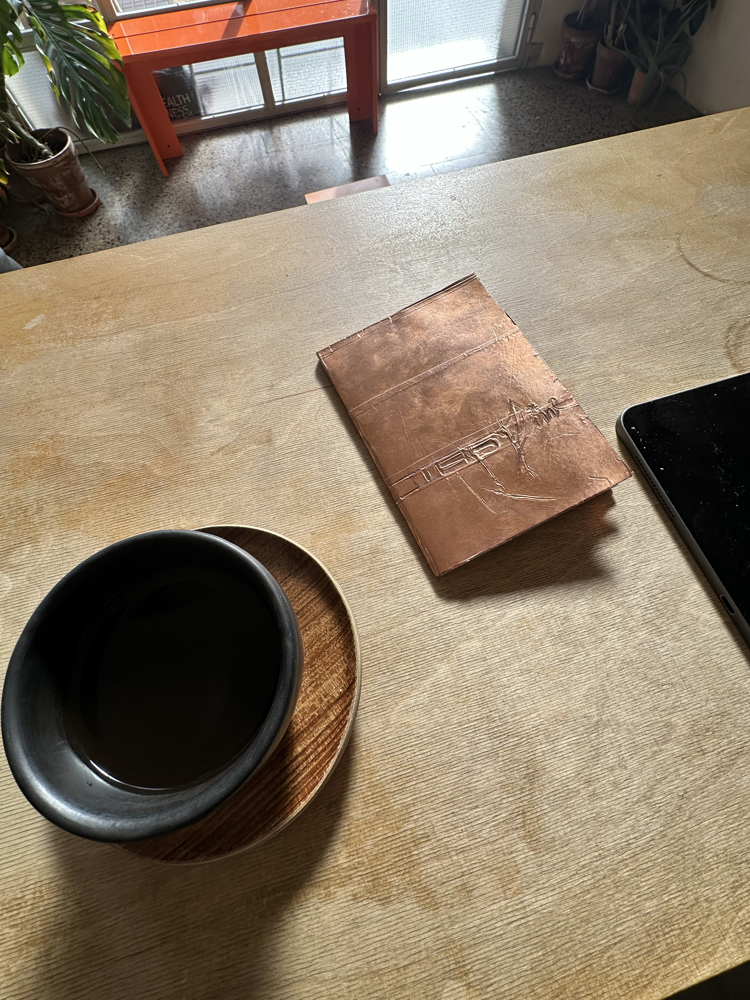
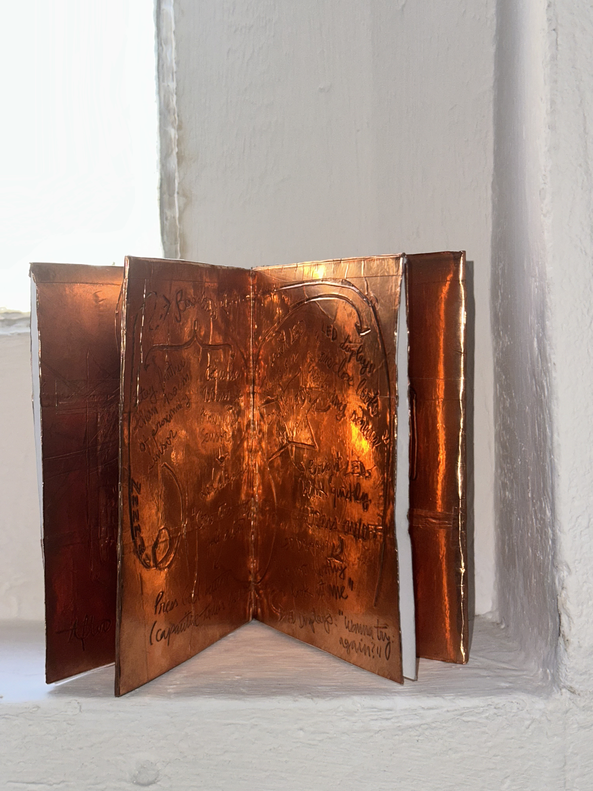
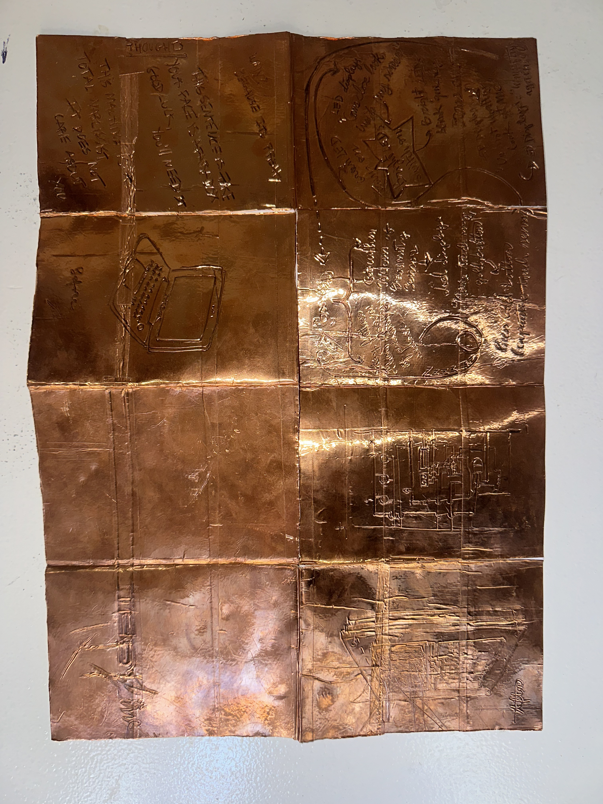
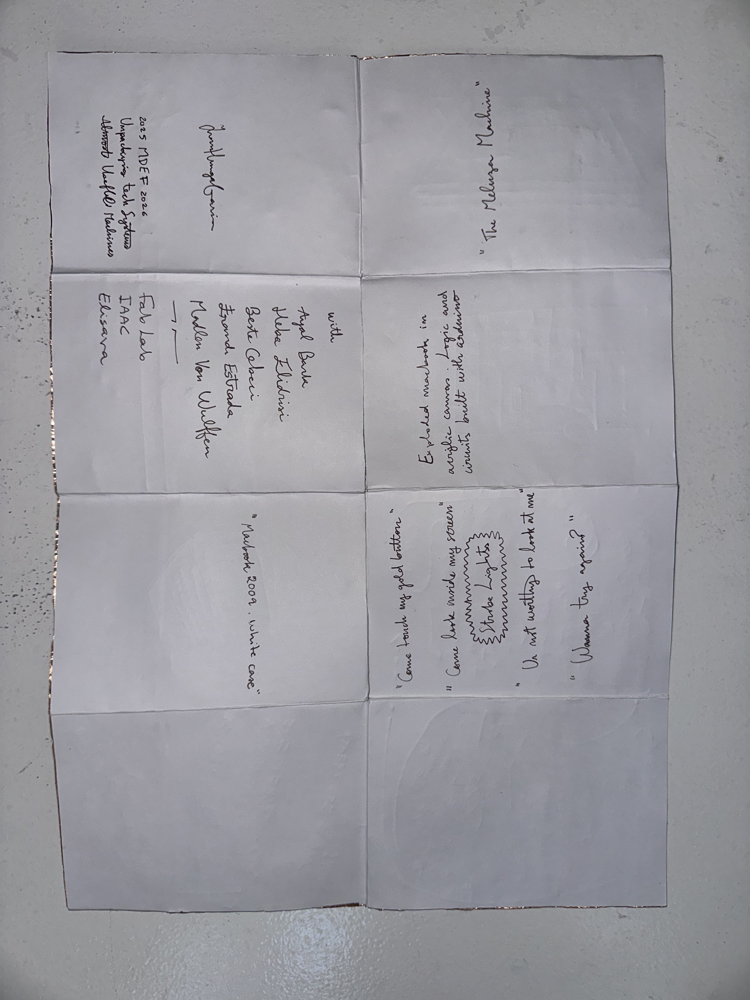

# Reflection

{ width="100%" }

As time passed, I never opened the devices since they still held such a pristine presentation. Until now. Now the conditions aligned with the predisposition to explore the layers of a MacBook 13-inch from 2009.

This computer was literally abandoned, with low expectations of having working components. The second feeling was the impasse of hacking a refined layout of electronics. Very small elements to which a DIY, fast-paced appropriation couldn't benefit.

Also, finding a 2009 MacBook instead of a more recent one allows for comparison of how they were still easily mountable. Today, the shell has fewer connections with the inside, simplifying inputs and "buildable" components for the user as an interface. But as a thinker, it becomes increasingly encrypted, limiting access and freedom of customization to personal preferences.

The micro-level of MacBook mounting was indeed time-consuming, although its organization is very appreciated when it comes to sourcing and tracking components. Everything is visibly identified and credited. The valuation of design, inside and outside, is noticeable.

Dissecting this device reminded me how fast-paced the electronic sphere and the world of post-capitalist consumption have become. A constant output of modeling and updating leads each gadget to be labeled as critically obsolete before its physical degradation. The hardware of this computer was in great condition, as was the inside, even under lack of care and maintenance.

It also reminded me how my computer will soon have its retirement. Not because I personally need a new computer or a more efficient one, but because software is gatekeeping performance out of previous models and technological antecessors. I am being cornered into purchasing a newer model, even though I treated my machine in a way that would allow it to thrive. 

The model I bought 12 years ago has a tough personality. It survived water and hackers but failed the test of time to keep up with today's vision of efficiency.

# Zine

{ width="100%" }

The vision for the zine, in order to have some relation to the Meluza Machine, was to work over copper tape. With scratches and stamping the information and graphics under a high-low marking. The Zine requires light conditions that create high highlights and high constrasts to be read.

{ width="49%" } { width="49%" }