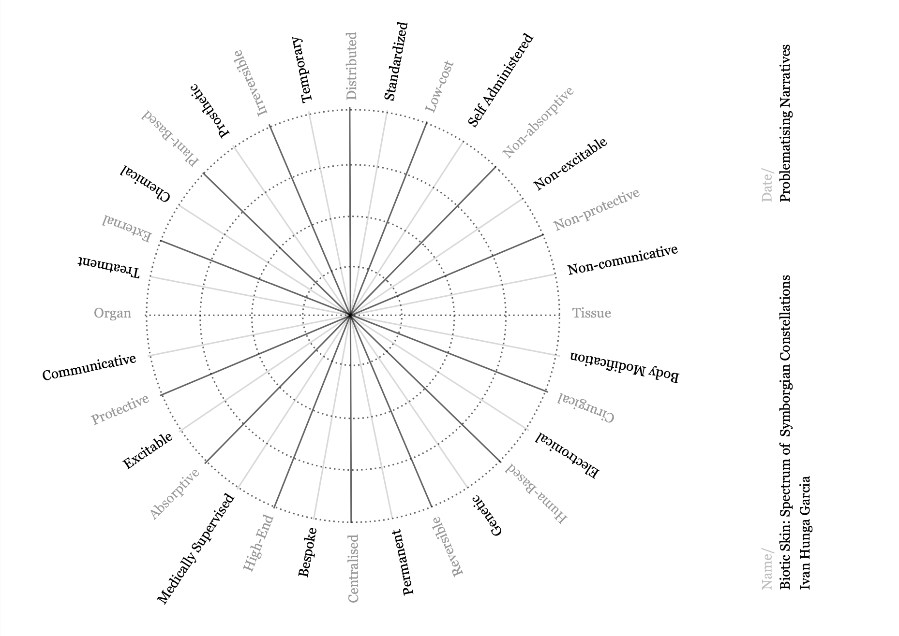

# Problematize

## Problematize Objects

<iframe style="position:absolute;border:none;width:100%;height:100%;left:0;top:0;" src="https://online.fliphtml5.com/fstbw/zsyp/" title="IHG_Spectrum of symborgian Constellations_answers" seamless="seamless" scrolling="no" frameborder="0" allowtransparency="true" allowfullscreen="true" ></iframe>

## Problematize Narratives

Project title: Biotic Skin

Subtitle: Living Textiles as a multispecies Symbiotic Gate to the Post Binary

### Spectrum of Symborgian Constellations

{ width="100%" }

### Guidelines: 

In between extremes choose your preference from 0%, 25%, 50%, 75% and 100%;

Each concept is relational and affected by the other. Furthermore, avoid an unrealistic approach: If an artifact is 100% bespoke, the probability of achieving a low-cost production is low;

Your decision can be based on what you would use, or based on research-potential;

Each constellation will constrain the iteration and ideation of prototypes, 22 variations and hypothesis;

The date is a guideline for development of ideas, the perception of the same person can differ within the timeframe;

Want to exclude a ray? cross it instead of doting it.

Identification is optional.

## Problematize Ethics

### Me as a planet / my community / Society / Planet as me

My project started and manifests from a deep lack of belonging caused by both projected doctrines
and self-alienation. And when it's time to problematize myself, there is no need to tell me twice. I'm
both high-maintenance and over-analytical when it comes to my relationship with people and my
own sense of personhood.

So what am I? I am a society of microorganisms. I voice their needs, indulge in their cravings, and
endorse their deficiencies. Am I a planet? And is Earth a humanoid to which we (people) are its
bacterial colonies? Let's speak in these fractals: me as a planet, my bacteria as its society, my skin
biome as my community, and me as the Earth to these interactions.

I've lived my experience on Earth as passable—a body interpreted as male, not Caucasian but white
enough to pass by, of African descent, to which my Portuguese background aims to tame. My body is
a battleground, and so is my mind and my behavior. That is where the depersonification of politics
enhances value in biotic skin theories. It's an abstraction of every conflict, and every thought that
humans found out to be chemical—and if it's chemical, it's manipulable on the physical level.

Psychology is no longer an abstract concept of the mind. It is actually affirming territory in the body.
Those are the battlefields I aim to study, problematize, and stretch into real-life scenarios.

Is this ethical? Or am I just avoiding, escaping the world's contingencies? There is nothing more
constraining than body politics and anatomy. Science once argued a woman was an ill figure—fragile
enough to avoid a 9-to-5, strong enough to be a domestic on-call servitude. Science is still biased by
personal and ethical agendas and beliefs. As they are only factual under a homocentric pointview.

Truth is, I am an avoidant. I distance myself from problems I have no direct response to. My reaction
is solution-based, and unless the solution is instant, I ignore it. I'm also masochistic, meaning I might
just adjust to the consequences of my avoidance. And since my planet's resources are
measurable—my sugar levels, the acidity of my sweat and saliva, the pH of my skin—the solution is
clear. I am what I insert in my body, what I allow to penetrate it, and the thoughts I allow to sink in.
Sometimes the most ethical reaction is knowing my place is not to respond but to listen.

Sincerely, as an author of this project, I haven't listened much to the community that benefits from
my resources. I have put them in service to me as I transition to the concept of care on a multi-scale.
If I don't respect myself enough to prepare a nutrient-rich meal, maybe I'll respect the bacteria once I
know them. If I sleep-deprive myself in the honor of the hustle, maybe I'll respect the organs that
manifest warnings as I acknowledge how to name them. Awareness is brought to the attention of
naming concepts—not as boxing but as learning. And that's something I have learned with the queer
community: labels are not meant to limit you but to allow you to explore concepts you didn't know
existed. And the more you dive into a subject, awareness of your ignorance is acknowledged.

My skin has different queendoms according to its ecosystem: the face, my scalp, my back and lower
back, pubic area, and feet. To each, different concerns apply. It's curious how we cannot apply the
same methods to ourselves that we apply to other people. I used the ritual of my hygiene products
from the society of my body to the society of a kombucha tank top. 

Although the effects are not so extreme on my own, it was made clear how harmful dollar store products were both to the SCOBY and to my own body. It became clear that a problem is never clear at the peak of the moment—one individual has to externalize or distance to see the full-blown effects. Different causes and effects, different solutions. Each action is site-specific. Nowadays, the one-size-fits-all charms are starting to fade away. The care of society should not be at the cost of individuality. And that is a subjectivity I cannot complement in a society that allows that.

I hope this text has shown how small a planet really is. It sure is overwhelming. As humans we are not
able to detach from it. It is beyond our anatomy. With this duality, distance when overextended, is
blurring as its flow. Reaching this position, the stage of society, individual even, are unclear.

## Problematize yourself

### Errors
Not being annoying enough (case study testing)

Stronger intersection in between stages of the acts

Is it cruelty free?

data deficiency

Consistency in picking up the subject and literature

### Fascinations

The world of bacteria

New perspective on care

The prototype is visceral... i love it

How it dictates time

Understanding neurospicyness

