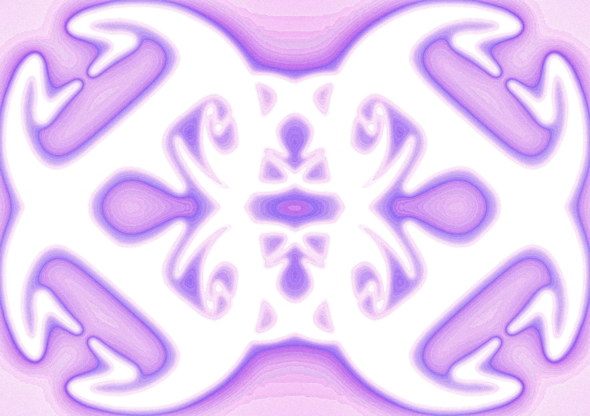

# Extended Inteligences III

{ width="100%" }

##Statements

I. I’m speaking in the first person and in the present , for impact purposes.

II. I see myself and living organism as perfect, I accept our role in the lifetime and space we take agency on. Interspace, Interpersonal, Interspecies speaking.

III. I don’t condone the willingness and tendency to self development or enhancement. Self expression comes in many shapes, forms and ideologies.

IV. I’m against the binary. Beauty-Ugly, Feminine-Masculine, Right wing-Left Wing, Organic-Synthetic, Analog-Digital. I show no interest in intervening in them all but I will endorse the ones how practice the initiative and knowledge may I lack.

V. Based on the clause 3, I condone the use of those enhancements for advantage on performance, advantage on war and advantage on manipulation or corruption over other people or species will of choice. Cheating on games is accepted.

VI. I recognise my agency as unique. With or without interfaces. Such as clothes, devices, tools, etc.

VII. I refuse to perceive my body with labels designated to industrialised products. Following the examples:“Cutting edge”, “Outdated”, “Standardised”, “Costumizable”, 99.9% effective, “accurate”, “neutral”, “Quality”, “Authentic”. Excluding: “Exclusive”

VIII. I reject endorsing self development in the name of the capital. If capital perceives time as money, so let my time be priceless.

IX. If Multi tasking is a construct based on scarcity. As a full being, I respect the agency properties and timeframe of each entity, expecting them to respect mine.

X. I acknowledge My necessities and desires change as much as my opinions, and believes. Only myself can design the timeframe and the approach to take within my surroundings.

XI. I define my mind as active externalising from its surrounding. I won’t deny the impact arts, writing and technology have in expressing my feelings, thoughts and emotions.

XII. I will accept the consequences of my behaviours under damaging the integrity of any manifestation of life. As I will accept the satisfaction that comes from that accountability.

XIII. The skill sets I aim to achieve will be for my own enjoyment as an ideation on how I want time to be perceived on my account.

XIV. I will not use technology to extract the right to act. Technology is a tool for my understanding and positioning as an entity in a collective.

XIV. I will not use technology to remove the agency on my current life, but to act mindfully emerged in it. I aim to project myself and other from numbness of the senses and interactions.

XIV.I As I will not endorse retracting and mimicking a living being agent from what they love  over the lack of effort to collaborate or profit.

XV. As something that does not bring me joy, I accept technology that allows me to dive into bureaucracy mindlessly. As it is a creation of an unforgiving systemic structure I have no intention in participating actively.

XVI. I accept the creation of organoids from my body. And every mutation from my dna is eligible and protected by the clauses of this contract as the entity must follow this guidelines.

XVII. I will not use organoids for the intentional harm of people, cultures, civilisations, ecosystems, microsystems or to misrepresent any of them. Neither I accept my cells to be used for such causes. They should actively focus on minimising cruelty.

XVIII. I will not use organoids as a legacy of my existence in this timeline. In any shape or form of clone of my identity.

XVIII.I. My presence in this shape and form is exclusive and to the responsibility of the ephemerality of atoms

XIX. I show no fear to technology. But due to its social implications I choose — for the agency of my body — not to become dependent or entangled with synthetic devices.

XX. Finally, I promise to articulate the knowledge I acquire in that journey in order to feed the omnipresent data, beyond my lifetime

##Abstract

The end goal of technology and organoids is becoming fully organic. Synthetic forms that follow biomimicry steps—mimicking shapes, structures, and behaviours—will transition into fully functioning organic connections of energy. Humankind learns through copying and assimilating behaviours, structures, and functions that go beyond human physical capabilities. This is the definition of biomimicry.

Recent studies prove the concept of pure electronics is decaying, giving space to bioengineering and biotechnology. The agency spectrum differs, of course. Although both are programmable, we shift from passive matter to active organisms taking part in the process. Therefore, that same agency transforms effort into collaboration.

Another question follows these developments: Does this effort fall within or outside biomimicry philosophies? If it is human-made, no matter how accurate to a living organism, its probability of being a mutation of natural references is high. Biomimicry protects the concept of what exists beyond human intervention. For these matters, are efforts to minimise the contrast between artificiality and organicity beneficial or dangerous? Noble or mischievous? Transparent or entitled?

If camouflaging biomimicry is in fact more dangerous than beneficial, reflecting on methods of recycling and upcycling matter becomes essential. Will the hybrid of living matter affect the generational cycle of organisms, its ability to reproduce, and by consequence, the extinction of species?

Wetware is subject to those same doubts. How intertwined are they with a body that will eventually die, decompose, and become an energy source for other species? How does wetware approach the inevitability of death? Is it considered a bone, a wearable, or something alienating to that process?

It is important to frame advancements of technology within the natural cycle of matter. For now, electronic waste is a concern. Will its fusion with organic beings be detrimental to the development of that sequence? Or is it corrupting it? Microplastics already coexist in waterflows and body fluids. Urban lifestyle is alienating us from our organic side, polarising further what it means to be a homosapien and what it means to become something else. Further and further away from the biological restrictions and features of humankind and the world it resides in.

Technology focused on pure electronics is something of the present, closer and closer to becoming the past. The calling for the future sometimes aims to redirect and repurpose present sources of knowledge. I imagine a future no longer dependent on lithium, steel, and polymers. I imagine a future where we become more aware and comfortable with the restrictions of the human physical form. In comparison to knowledge and imagination, which can delve into infinite possibilities and scenarios. This fascinates me about human behaviour and its interpretation of reality.

The possibilities for the future are limitless. Although I have grown tired of focusing on what I lack, what I do not have, or what I am not able to do. I crave, ironically, a sense of settledness which, unless decided and clear, will become insatiable, just like technological development. This state of mind aims to be mindful of individual reach outside the reactionary culture of self-upgrading, nowadays associated with tech literacy and endorsement. I am not against it, but I also have the courage to say that I am perfect by acknowledging how simple my life can be by deciding so.

Could a machine — artificial organoid — define its destiny? Have the agency to decide whether or not to help me within my daily tasks? Or will its only space be guarded as a reactive element.

FLAG - Cell structure and the fluidity of interconnections
Purple scale references to ultraviolet rays as something not perceived from the human eye
Edges suggest a commutative juxtaposition of that is internal and external.
