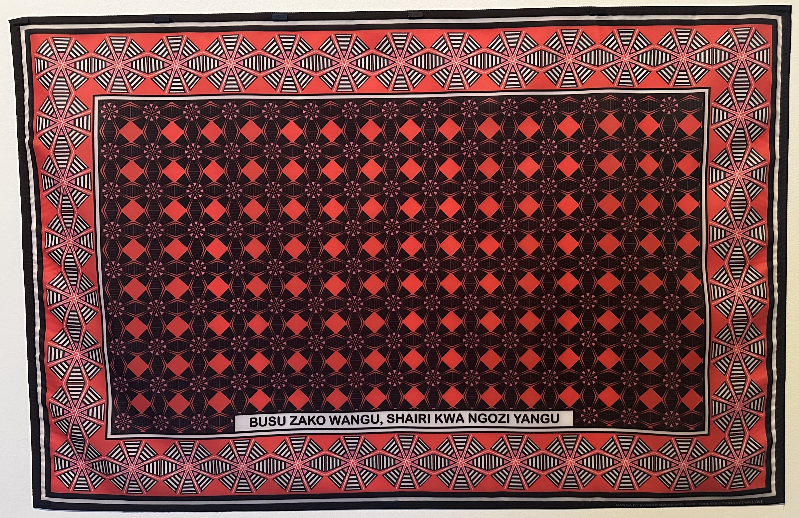

# Situated Design Practices

Digital, organic; extractivism, regenerative; collaborative, hierarchical. These are polarisations where I look forward to centring my practice in design. It is important to note that they are not negations of one another but coexisting tensions that inform my work.
I am fascinated by how corporate settings operate, particularly visible in the Barcelona’s Supercomputer project [image 1]. I appreciate structure and settings bursting with ambition and commitment. The super computer and the quantum computer hold hyper specific criteria and specifications. Research conducts at its core. This allowed me to unleash the acceleration on ideas based on my commitment to see them applied in the real world. Even if it requires the world to adjust to it other than the project to adjust to real demands by default.
The philosophy of Prat's resident farmers is quite the opposite, almost as a utopia perspective cornered with burocracia tensions and overlapping of interests. I would highlight the mindfulness of site-specific projects and intentions since they focus on the field. This tension makes me consider:

How can a formula trigger completely different results under multiple scenarios?

It reminds me of the Arts and Crafts movement's response to the industrial revolution of England in the eighteenth century. Cutting-edge and avant-garde practices derive from resourcefulness and a strong sense of vernacularity applied to a flexible mindset. The question becomes:

How do we scale care without losing specificity?

This question of scale intersects with Aza's observations on the fluctuation of labels applied to visitors: to be a refugee or to be an economic/climate immigrant. Mercedes similarly discussed the invasiveness and hyper-vigilancy within the metrics of surveillance, whether for classist, racist, or gender reasons. I believe it is common sense that the more something is suppressed, the more it lingers in someone’s body  or territory. There are lots of resources spent just to suppress, silence and dismantle someones identity. That’s the main reason I hold BDSM with the capacity to healing and release, highly targeted to identity core values, behaviours and intimacy. I recognised how much of a niche it is to be open-hearted. My design practice became situated in the flesh, in a context where individuality becomes abstract.
Within the same week, an extra stop was make related to Situated Design Practices: PROYECTAR UN PLANETA NEGRO. EL ARTE Y LA CULTURA DE PANÁFRICA en MACBA. Which reflects and rematches the biased nature of Hu-Man His-story. Where we cannot base collaboration with convenience. Herstory, just like time, isn’t linear. It can be difficult to compact worlds doings in one go. But it is knowledge that must be multilateral and based on contribution of each one involved. In this exhibitions, it is visible a snippet on how Thinkers of African descent and diasporas approach their own trajectory of beliefs, tensions and borders. A continent to which literature and legacy was mutated with the foreigner’s perception. Due to my duality, I might have struggles a lifetime to situate my practice. Although, the grey-area is a virtue due to the possibility and responsibility to mediate but also represent its multitude on ones perception. [Image 2, 3]
It is just as important to present a good future as it is to highlight the rotten present, something I saved from one lecture with Grandeza Studio, and who I happen to found In the exhibition. I have always seen my work as somewhat tone-deaf, non-verbal, non-political. When in fact, the normalisation of the freak, diasporic and queer momentum is primal. My practice legitimises experiences without defensiveness but with centralising it in the making of a living archive, also something I learned with Zannele Muholi’s work. Non-reactive but present, very much present and aware of the resonance that normalisation instigates in an individual.

The reasoning flows into How do you amplify those properties by influencing the future whilst being active in the now? 	And,	 how do I translate the knowledge passed by my ancestors into the contemporary demands.

My works — and myself — have been called many things: Eco-brutalist, Post-punk, Gore, Esoteric. They can be everything and nothing simultaneously. Since I wasn’t the one to define it. But what they must be is assertive in the message they embody and portray, like a Dom. What is controversy in a politic where that is already violent? What is shock value in bringing to the light something that is unapologetically condemned. I look forward to shifting the mindset that affects both the projects I engage with and the different disciplines by crossing with traditional rituals. This means centring regenerative practices as actionable methodologies grounded in care, self sufficiency and site/subject-specific responsiveness.

{ width="100%" }

[Image1, Left] Super computer of barcelona, Chappell with the quantum computer.

{ width="100%" }

[Image 2, Right] Queer African Manifesto/Declaration, 2010

Following a historic gathering in 2010, various authors anonymously penned a queer African Manifesto sharing a vision of re-articulating their lives outside of dominant categories of identity and power.
This text evokes a long history of declarations resulting from Pan-African congresses, and outlines commitments to reclaim and redistribute power.

{ width="100%" }

[image 3, Bottom] Kawira Mwirichia, To Revolutionary Type Love, or Kanga Pride.
